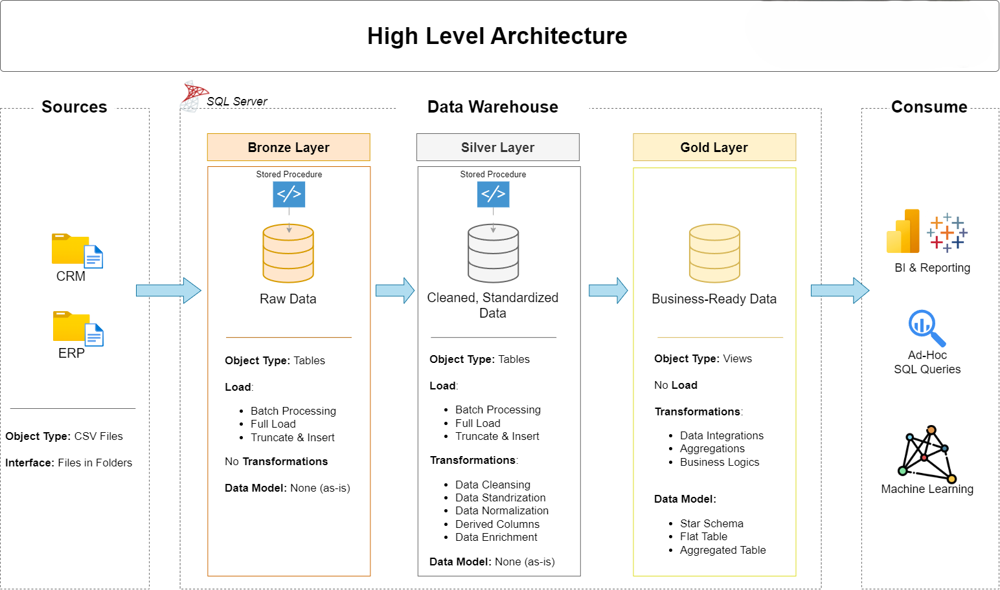

# Data Warehouse and Analytics Project

Welcome to the **"Data Warehouse and Analytics Project"** repository!
This project demonstrates a comprehensive data warehousing and analytics solution, from building a data warehouse to generating actionable insights. Designed as a portfolio project, it highlights industry best practices in data engineering and analytics.

---
## 🏗️ Data Architecture

The data architecture for this project follows Medallion Architecture **Bronze**, **Silver**, and **Golden** layers:


1. **Bronze Layer**: Stores raw data as-is from the source systems. Data is ingested from CSV Files into SQL Server Database.
2. **Silver Layer**: This layer includes data cleansing, standardization, and normalization processes to prepare data for analysis.
3. **Golden Layer**: Houses business-ready data modeled into a star schema required for reporting and analytics.

---
## 📖 Project Overview

This project involves:

1. **Data Architecture**: Designing a Modern Data Warehouse Using Medallion Architecture **Bronze**, **Silver**, and **Golden** layers.
2. **ETL Pipelines**: Extracting, transforming, and loading data from source systems into the warehouse.
3. **Data Modeling**: Developing fact and dimension tables optimized for analytical queries.
4. **Analytics & Reporting**: Creating SQL-based reports and dashboards for actionable insights.

🎯 This repository is an excellent resource for professionals and students looking to showcase expertise in:
- SQL Development
- Data Architect
- Data Engineering  
- ETL Pipeline Developer  
- Data Modeling  
- Data Analytics  

---

## 📋 Project Requirements

### 🏗 Building the Data Warehouse (Data Engineering)

#### Objective

Develop a modern data warehouse using SQL Server to consolidate sales data, enabling analytical reporting and informed decision-making.

#### Specifications

* **Data Sources**: Import data from two source systems (ERP and CRM) provided as CSV files.
* **Data Quality**: Cleanse and resolve data quality issues prior to analysis.
* **Integration**: Combine both sources into a single, user-friendly data model designed for analytical queries.
* **Scope**: Focus on the latest dataset only; historization of data is not required.
* **Documentation**: Provide clear documentation of the data model to support both business stakeholders and analytics teams.

---

### 📊 BI: Analytics & Reporting (Data Analytics)

#### Objective

Develop SQL-based analytics to deliver detailed insights into:

* **Customer Behavior**
* **Product Performance**
* **Sale Trends**

Thse insights empower stakholders with key business metrics, enabling strategic decision-making.

## 📂 Repository Structure
```
sql-data-warehouse/
├── datasets/
│   ├── source_crm/
│   │   ├── cust_info.csv
│   │   ├── prd_info.csv
│   │   └── sales_details.csv
│   └── source_erp/
│       ├── CUST_AZ12.csv
│       ├── LOC_A101.csv
│       └── PX_CAT_G1V2.csv
├── docs/
│   ├── data_architecture.png
│   ├── data_catalog.md
│   ├── data_flow.png
│   ├── data_integration.png
│   ├── data_layers.pdf
│   ├── data_model.png
│   ├── ETL.png
│   └── naming_conventions.md
├── README.md
├── scripts/
│   ├── bronze/
│   │   ├── ddl_bronze.sql
│   │   └── proc_load_bronze.sql
│   ├── golden/
│   │   └── ddl_gold.sql
│   ├── init_database.sql
│   ├── placeholder
│   └── silver/
│       ├── ddl_silver.sql
│       └── proc_load_silver.sql
└── tests/
    ├── quality_checks_golden.sql
    └── quality_checks_silver.sql
```

---

## ☕ Stay Connected

Let's stay in touch! Feel free to connect with me on the following platforms: <br/>
[](https://www.linkedin.com/in/alauddin-jahin-8008b1183)
[](https://alauddinjahin.vercel.app)

## 🌟 About Me

Hi there! I'm **Alauddin Jahin**. I’m a Senior Full Stack Developer and I try to share my knowledge and make working with data enjoyable and engaging!

